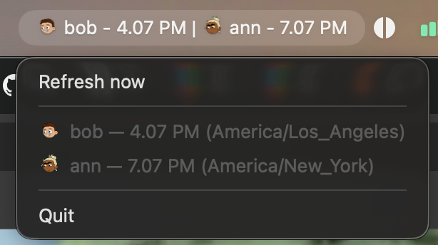

# theirtime



Their local time. Right in your menu bar.

If you work across timezones, you end up checking profiles or doing mental math before you message someone. **theirtime** shows coworkers' current local times in your **macOS menu bar**, with their Slack profile pictures beside each clock. Open the menu for timezone detail.

By default the menu bar shows **avatar + time only** (no name labels). You can change what's visible and how time is formatted — see [Config](#config).

There's no theirtime server or account. You create your own Slack app; credentials stay in your Keychain. macOS only.

## Install

```bash
curl -fsSL https://raw.githubusercontent.com/haritabh17/theirtime/main/scripts/install.sh | bash
theirtime onboard
```

`onboard` opens a pre-filled Slack app manifest, then walks you through OAuth.

```bash
theirtime team add bob U012ABCDEF    # label + Slack member ID (profile → ⋮ → Copy member ID)
theirtime install-agents             # starts menu bar when team is non-empty
theirtime status                     # is it running?
theirtime auth                       # re-authorize after a token revoke
theirtime offboard                   # uninstall everything
```

Times come from each person's **Slack profile timezone**. The menu bar clock updates every minute; Slack profiles (timezone and avatar) refresh every 15 minutes.

Logs: `~/Library/Logs/theirtime/menubar.log`

## Config

Control what appears per teammate and how time is formatted (same prefs for menu bar title and dropdown):

```bash
theirtime config set show_avatar true    # default: true
theirtime config set show_name false     # default: false — set true to show labels
theirtime config set show_time true      # default: true
theirtime config set format_24h false    # 12h vs 24h clock
theirtime config set time_precision minutes   # or hours (e.g. 4.07 PM vs 4 PM)
theirtime config get
```

| show_avatar | show_name | show_time | Menu bar example |
|-------------|-----------|-----------|------------------|
| true | false | true | `[img] 4.07 PM` **(default)** |
| true | true | true | `[img] bob - 4.07 PM` |
| false | true | true | `bob - 4.07 PM` |
| true | false | false | `[img]` only |

After changing display settings, restart the menu bar agent: `theirtime install-agents`.

## Team commands

```bash
theirtime team add <label> <U…>
theirtime team list
theirtime team remove <label>
```

## Privacy

Credentials and OAuth tokens go in Keychain. Preferences (no secrets) live in `~/Library/Application Support/theirtime/config.yaml`. The OAuth callback listens on `127.0.0.1:8765` only. No telemetry.

## Developing

- Manifest: [`manifest/theirtime.manifest.yaml`](manifest/theirtime.manifest.yaml)
- Tag `v*` → GoReleaser binary on [GitHub Releases](https://github.com/haritabh17/theirtime/releases)
- [CLI build plan](docs/PLAN-cli.md)
- `theirtime menubar --demo` — preview menu bar UI with bundled cartoon avatars (no Slack; useful for docs/screenshots)

Dev env vars: see [`.env.example`](.env.example).
